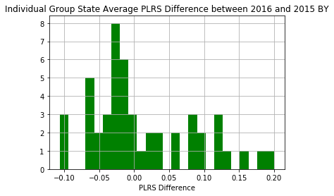
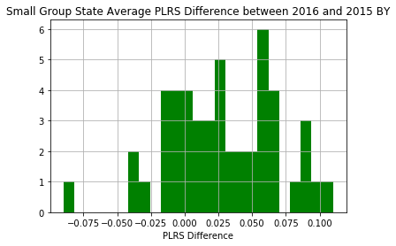

# Week 2

0. (*Preprocessing.*) For my own sake, I need to figure out why my CSV files are automatically compressing the data into one column. This is very annoying to deal with, as it basically renders the CSV unusable. For now, I will save files in an XLSX format until this is rectified. Because of these CSV issues, I need to recreate datasets for 2015 and 2016 individual and small group PLRS data from the Appendices.

This task has been finished and saved as XLSX format to avoid further errors of the sort. GitHub commit **3e079b5** has the correct XLSX files, in case there is further corruption of data.

Qualitative question: why are many transfers 0? If they do not have transfers in the marketplace, I assume that they just aren't active in that specific marketplace. I googled this and couldn't find anything. Is there any definitive way to know? Also, related to what we discussed when we met last week, there is no difference in on-exchange vs. off-exchange to my knowledge: https://www.healthinsurance.org/obamacare/off-exchange-plans/

- - -

1. (*Histogram.*) Look at 2015 vs. 2016 PLRS change in a histogram for both the individual and the small group markets.

- - -

2. (*PLRS per member month.*) Look at the difference in PLRS vs. payments per member month in various states.

To do this, first I will clean the old dataset of all 2015 companies so that it matches what we want to find. I matched the companies with their actual risk transfer values. I did an outer merge.

We computed: $$\frac{\sum |transfers|}{\sum member months}$$ per state.

We are looking to correlate above with payments per member month.

Our hypothesis: positive correlation; ratio should be ~$10 PMM. 

The ratio is ~$10 PMM in some mid-range states like Kentucky, Idaho, Illinois, and Arkansas, but here I have also found that they were quite a bit bigger for some states... mostly small states that have few member months or large states that have huge volumes of transfers. Take the large states such as CA, NY. These have pretty high values. I bolded values above 30. Ignore the fact that Google translated these numbers into phone numbers.

A description of some outliers: 

- Alaska has the same amount of transfers, approximately, in the individual group, but has 1/10 the member months as some of the other states. Hence it is 10x bigger than most of the other values.

- Delaware has very few member months compared to the other states.

- Florida  and New York have a huge volume of absolute transfers in the individual group

Full table of values (columns 4-7 represent the sums in the formula above):

| state | individual ratio | small group ratio | individual transfers | smallgroup transfers | individual mm | smallgroup mm |
|-------|-----------------|-----------------|---------------------|---------------------|--------------|--------------|
| AK    | 75.9058290493   | 17.8564813495   | 24716911.49         | 5813498.92          | 325626.0     | 325568.0     |
| AL    | 9.41952716298   | 1.36972222751   | 26984194.82         | 3882891.31          | 2864708.0    | 2834802.0    |
| AR    | 7.6272759049    | 2.52594034274   | 30195874.28         | 3852172.69          | 3958933.0    | 1525045.0    |
| AZ    | 35.498774775    | 13.7372186702   | 137427755.74        | 29347438.42         | 3871338.0    | 2136345.0    |
| CA    | 23.2808723061   | 16.0037170988   | 628633885.51        | 327333099.93        | 27002162.0   | 20453567.0   |
| CO    | 29.5011554816   | 7.67982376148   | 98259941.08         | 19113875.61         | 3330715.0    | 2488843.0    |
| CT    | 34.90164113     | 28.9389420989   | 71536742.07         | 61008064.87         | 2049667.0    | 2108165.0    |
| DC    | 30.5561524334   | 28.9875967766   | 7021162.15          | 31090559.96         | 229779.0     | 1072547.0    |
| DE    | 125.635002004   | 42.3622295363   | 5641262.86          | 4794387.69          | 44902.0      | 113176.0     |
| FL    | 57.840819498    | 6.30009055787   | 1177008909.25       | 50019972.19         | 20349105.0   | 7939564.0    |
| GA    | 28.2658776103   | 5.86756297927   | 204697669.76        | 27926448.9          | 7241865.0    | 4759463.0    |
| HI    | 57.7755799186   | 10.2461004888   | 30934201.0          | 15970812.0          | 535420.0     | 1558721.0    |
| IA    | 14.9556015642   | 5.95307387947   | 34340887.8          | 11010364.92         | 2296189.0    | 1849526.0    |
| ID    | 13.6834227733   | 5.98324833186   | 23193278.45         | 5556816.24          | 1694991.0    | 928729.0     |
| IL    | 8.77254438625   | 5.95276064256   | 67848191.71         | 36918104.78         | 7734152.0    | 6201846.0    |
| IN    | 39.3838130149   | 6.3453533349    | 110276724.4         | 20335899.29         | 2800052.0    | 3204849.0    |
| KS    | 30.2590870638   | 3.6871168816    | 64390399.24         | 6767161.03          | 2127969.0    | 1835353.0    |
| KY    | 7.9568221066    | 5.53533396078   | 15442711.74         | 8816054.44          | 1940814.0    | 1592687.0    |
| LA    | 42.9844374303   | 4.97511188642   | 135958013.23        | 15701517.79         | 3162959.0    | 3156013.0    |
| MA    | 0.0             | 0.0             | 0                   | 0                   | 2762504.0    | 5684606.0    |
| MD    | 23.0399333938   | 22.2446383211   | 77453321.05         | 69193971.76         | 3361699.0    | 3110591.0    |
| ME    | 8.53990932027   | 12.9428685312   | 8248928.99          | 9955770.96          | 965927.0     | 769209.0     |
| MI    | 38.0988229641   | 5.4190254533    | 198376494.6         | 30145464.18         | 5206893.0    | 5562894.0    |
| MN    | 23.8868145961   | 15.4996591943   | 88870630.95         | 51094812.53         | 3720489.0    | 3296512.0    |
| MO    | 16.379289842    | 5.76934580677   | 70040021.81         | 16864178.57         | 4276133.0    | 2923066.0    |
| MS    | 21.4138865826   | 1.01398545446   | 30810107.29         | 1041204.88          | 1438791.0    | 1026844.0    |
| MT    | 11.3426658616   | 8.14031030464   | 11027294.38         | 4309341.89          | 972196.0     | 529383.0     |
| NC    | 15.772015271    | 9.79778873918   | 136341422.59        | 31991700.6          | 8644515.0    | 3265196.0    |
| ND    | 5.20637505894   | 1.50819987251   | 3433807.4           | 1135644.34          | 659539.0     | 752980.0     |
| NE    | 30.1584801354   | 18.8500230878   | 47671509.55         | 17831254.74         | 1580700.0    | 945954.0     |
| NH    | 31.1881732443   | 10.9742835138   | 23449233.5          | 9383231.89          | 751863.0     | 855020.0     |
| NJ    | 59.0375539256   | 16.2425755517   | 216567340.99        | 96539063.44         | 3668298.0    | 5943581.0    |
| NM    | 30.7970861294   | 15.5762931817   | 28293252.23         | 10105883.44         | 918699.0     | 648799.0     |
| NV    | 29.9764675182   | 14.6013498007   | 47644117.85         | 15045289.24         | 1589384.0    | 1030404.0    |
| NY    | 73.3302923972   | 54.5745893385   | 459597754.26        | 683992496.71        | 6267502.0    | 12533168.0   |
| OH    | 26.6732957593   | 5.66016900368   | 118240932.99        | 50049540.66         | 4432933.0    | 8842411.0    |
| OK    | 4.3317055078    | 4.57727035151   | 9421333.86          | 9514167.68          | 2174971.0    | 2078568.0    |
| OR    | 24.9773506137   | 11.021275008    | 70745548.15         | 23228725.76         | 2832388.0    | 2107626.0    |
| PA    | 37.7493698429   | 7.1466775647    | 284709069.3         | 63973226.94         | 7542088.0    | 8951464.0    |
| RI    | 38.2110693287   | 18.0608385382   | 19360517.13         | 13437643.15         | 506673.0     | 744021.0     |
| SC    | 12.7339735041   | 7.49317455896   | 36455532.45         | 9791623.43          | 2862856.0    | 1306739.0    |
| SD    | 8.37354764179   | 6.1461612027    | 7748579.54          | 3584158.49          | 925364.0     | 583154.0     |
| TN    | 13.9111491021   | 4.3601827751    | 51297918.76         | 15770362.52         | 3687540.0    | 3616904.0    |
| TX    | 15.2463451304   | 2.41059542428   | 261467043.35        | 34532213.36         | 17149490.0   | 14325180.0   |
| UT    | 24.740051582    | 2.88369549718   | 69756802.04         | 7349141.23          | 2819590.0    | 2548515.0    |
| VA    | 21.6833217745   | 21.2225228353   | 134040158.83        | 95627966.33         | 6181717.0    | 4505966.0    |
| WA    | 34.3971813742   | 19.2436753686   | 134060159.44        | 57123637.98         | 3897417.0    | 2968437.0    |
| WI    | 24.659953423    | 9.22076975061   | 68361928.32         | 35857535.77         | 2772184.0    | 3888779.0    |
| WV    | 1.46652866913   | 6.50366778102   | 765513.3            | 3809146.19          | 521990.0     | 585692.0     |
| WY    | 16.1150680304   | 9.63754780974   | 5424557.51          | 2492048.2           | 336614.0     | 258577.0     |

An Error I got: 'utf-8' codec can't decode byte 0x96 in position 39: invalid start byte
Solution: use encoding = 'ISO-8859-1'

- - -

3. (*Large companies leaving the marketplace.*) I was talking about this with my writing seminar professor today. His brother works at United Health. He mentioned to me that United Health is really unsure what to do as large companies such as Amazon, JP Morgan, etc. start cutting out the middle man employer because they want to go directly to the provider. Losing so many customers (in the large group market?) should have impacts on the other groups as well, if they no longer pull in a steady stream of revenue from these large companies. Here is a news article about it: https://www.cnbc.com/2018/01/30/amazon-berkshire-hathaway-and-jpmorgan-chase-to-partner-on-us-employee-health-care.html 

- - -

4. (*Other stuff.*) Expect abs(ti) ~ Sqrt(Ni)

X1...XN payments
randomly distributed to 
N1 + N2 + .. Nt companies
Sum(Sum(Xi))

Sum(Xi)  roughly proportional to sqrt(min(ni, n-ni))/Ni

How do much do we deviate from expectation? Predicted amount per insurer
Ni = ember month per insurer
N = total member months in state
